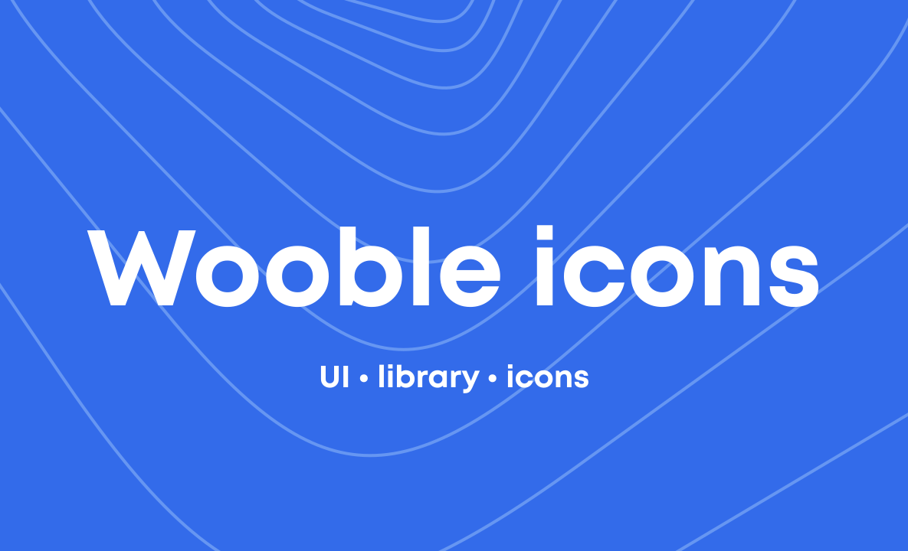

<p align="center">
	<a href="https://ui.wooble.team">
		
	</a>
</p>

<h1 align="center">It's wooble UI icons pack</h1>

<p align="center">
	It's wooble UI icons pack.
</p>

## 📦 Install

```bash
npm install @itswooble/icons
```

```bash
yarn add @itswooble/icons
```

## 🔨 Usage

```jsx
import React from 'react';
import { PaperFail } from '@itswooble/icons';

const App = () => (
	<>
    	<PaperFail color='blue300' />
  	</>
);
```

### TypeScript

`@itswooble/icons` is written in TypeScript with complete definitions.

## 🔗 Links

- [Home page](https://ui.wooble.team/)
- [Components Overview](https://ui.wooble.team/docs)
- [It's wooble Icons](https://ui.wooble.team/icons)
- [Npm page](https://www.npmjs.com/package/@itswooble/ui)

## ⌨️ Development
Clone locally:

```bash
$ git clone git@github.com:wooble-place/wooble-icons.git
$ cd wooble-icons
```

## 👋 Founders  
- [Kirill Osintsev](https://github.com/crashzky)
- [Dmitriy Gorbunov](https://github.com/DimaGorbusha) 
- [Alexander Isakov](https://dribbble.com/Alexis4049)
- [Sofia Sokolova](https://www.behance.net/sofa_sofkrad)